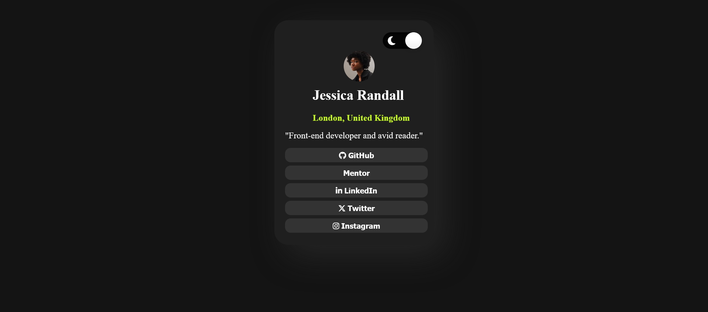

# Frontend Mentor - Social links profile solution

This is a solution to the [Social links profile challenge on Frontend Mentor](https://www.frontendmentor.io/challenges/social-links-profile-UG32l9m6dQ). Frontend Mentor challenges help you improve your coding skills by building realistic projects. 

## Table of contents

- [Overview](#overview)
  
  - [Screenshot](#screenshot)
- [My process](#my-process)
  - [Built with](#built-with)
  - [What I learned](#what-i-learned)
  - [Continued development](#continued-development)
  - [Useful resources](#useful-resources)
- [Author](#author)
- [Acknowledgments](#acknowledgments)

## Overview
This is a responsive social links profile built using HTML and CSS.

### Screenshot

## My process
- Working with the basic HTML;
- Used CSS to add styles to the HTML page;
- Added a toggle button for dark born and used JavaScript and CSS to make it fully functional

### Built with

- Semantic HTML5 markup
- CSS custom properties
- CSS Grid
- Mobile-first workflow
- JavaScript

### What I learned

I learnt more about hover and focus for interactive elements on a webpage;

### Continued development

 -Find a less tasking way to create a toggle switch for a webpage;
 -Add a custom icon to the Master button

### Useful resources

- [Quora](https://www.quora.com) - This helped me to find other ways of making a website responsive without using media queries;
- [Stack Overflow](https://stackoverflow.com/) - This is a great forum to find answers for situations for example it helped a lot when I was adding icons to the buttons.

## Author

-  Frontend Mentor - [@enochmwanga](https://www.frontendmentor.io/profile/enochmwanga)
